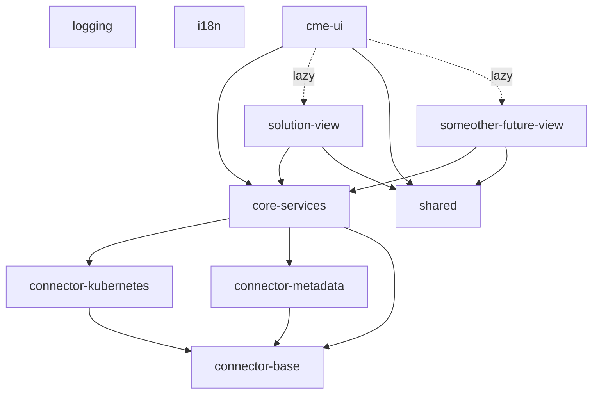

# CME v2

## Definition of Terms

| Term             | Definition                                                                                           |
| ---------------- | ---------------------------------------------------------------------------------------------------- |
| CME              | Consort Microservice Experience                                                                      |
| View             | an independent part of the application shown in the main content area, reachable via main navigation |
| Palette          | The property pane of a view                                                                          |
| Project          | A specific project of a customer that uses microservices                                             |
| Phase            | A project can have different Phases. Phases categorize and sequentialize participating microservices |
| Solution Diagram | Diagram containing all phases with its microservices that are part of the project                    |
| Environment      | E.g. development or production                                                                       |
| Cluster          | The kubernetes cluster                                                                               |

---

## Project Documentation

### Structure

Every app/library may depend on `logging` and `i18n`.
`showcase` project is omitted in this diagram for clearness. It may depend on anything the `cme-ui` depends.



To view an always up-to-date dependency graph, use command `npm run dep-graph`.

### Create new View

To create a new _view_ do the follwing:

1.  Create a new lazy loaded module lib for the view: `ng generate lib my-new-view --routing --lazy --parentModule=apps/cme-ui/src/app/app.module.ts --tag=view`

2.  Set the `cme` prefix for this lib in its app config of `.angular-cli.json`

3.  Create an entry component that uses `cme-view-container` to set up the subheader and palette (optional)

4.  Add the route to `app-routing.module`

5.  If the view should show up in presentation mode, add the following route data:

    ```typescript
    {
      shouldShowInPresentationMode: true,
      pageName: 'my-new-view'
    }
    ```

6.  Add the menu entry to `navigation.component.ts` (this should be automated some time in the future)

7.  For translation create `en.json` and `de.json` somewhere in the src folder of the new module library, e.g. in a subfolder called `i18n`. Content should be `{}` for both, otherwise we'll get errors later when extracting translation keys

8.  To be able to directly import the json files, we need to define a dynamic module, so that TypeScript knows what's going on. We do this by creating a `typings.d.ts` file in the lib's src folder with this content:

    ```typescript
    declare module '*.json' {
      const value: any;
      export default value;
    }
    ```

9.  In the lib's root module import `I18nModule.forChild()` and add the content of those translation json files as arguments:

    ```typescript
    import * as translationsDe from './i18n/de.json';
    import * as translationsEn from './i18n/en.json';

    // Translations must be exported to work with aot in prod build!
    export const en = translationsEn;
    export const de = translationsDe;

    ...

    I18nModule.forChild({ en, de });
    ```

    Don't forget to export the imported json translations, otherwise translation will not work in production builds!

10. Import `I18nModule` in the entry component's module and add a translatable title to the `cme-view-container`, like `[title]="'my-new-view.title' | translate"`

11. Add an `extract-translations:my-new-view` npm script. Also call this new script from within the `extract-translations` script

12. Run the `extract-translations` script and add the tranlation values to the newly created keys in the main app's language json files and the new view's language json files

13. Add the translation key and value for the navigation entry to the language json files of the main app:
    ```json
    "my-new-view": {
      "menu-entry": "My New View"
    }
    ```

Done. We should definitely automate some steps of this process, e.g. with schematics. :-)

### Logging

Don't use `console.log()` or the other console methods for logging. Use the
class `LogService` in `@cme2/logging` instead.

### Internationalization (i18n)

We use http://www.ngx-translate.com/ for translations. This is encapsulated in the project `i18n`.

For information about how to use it, please see here: https://github.com/ngx-translate/core#4-use-the-service-the-pipe-or-the-directive.

Lazy loaded modules like `SolutionView` bring their own translations. To avoid dependencies from main app to those views, `I18nModule.forChild(...)` provides functionality to merge additional child translations into the global translations.

#### Extracting translations

The easiest way to add new translations is to first add it to the template where the text shall be shown, e.g. via `{{ 'my-component.my text t' | translate }}`. Then let the `extract-translations` script add the new keys and in the end add the correct translation values for the keys:

Run `npm run extract-translations` to extract the translation keys. They will be added to the correct `{en,de}.json` files depending on whether the translation key was added to the main app or a _view_ (views are responsible for setting up their language files and add an appropriate script). You should always git commit before doing so, to easily see the changes.

`ngx-translate-extract` is used under the hood. It won't find all translation keys, especially if hidden in some bindings, but hopefully it helps. Be aware, that unused keys are not deleted. There is an option for this (`--clean`) but it's way too zealous.

### REST Clients

#### Generating Angular REST Clients from swagger files

Our microservice backends all have a valid swagger file. We can generate Angular Services to access those REST interfaces.

The code generator expects JAVA to be installed on your machine.

Steps to follow:

1.  Generate a new library project according to the naming convention `connector-[name]` with
    `ng generate lib connector-xxxx --tag=core-connector`. Replace tag 'core-connector' with 'view-connector' if it is a connector which is only relevant for a specific cme-ui view.

2.  Add your new connector to the script `generators/swagger/generateRestClients.sh`.

3.  Run `npm run generate-rest-clients`.

The REST client should be generated into your new library.
`npm run format` will be executed afterwards to fix code styling.

4.  Import the new module into `CoreServicesModule` if it's a core service, or in your matching view module if it's a view specific thing. You may need to use namespace aliasing because all generated REST modules are called ApiModule.

Example:

```
import { ApiModule as ConnectorKubernetesModule } from '@cme2/connector-kubernetes';
import { ApiModule as ConnectorMetadataModule } from '@cme2/connector-metadata';
```

#### Using mocks for specific Microservices

You can set the key `cme2.mockUrls` in localStorage to specify a different url for one or more specific backend services.

The key names must match the generated typescript class names in `connector-xxx/src/api/*`.

Example:

```json
{
  "JiraBackendService": "http://localhost:8081",
  "ProjectService": "http://localhost:8082"
}
```

would use local urls for the two mentioned services, all other services will use the default cluster connection.

You can generate simple mock services by pasting the swagger.yaml into http://editor.swagger.io (important: don't use https, otherwise server generation will fail) and select "Generate Server -> nodejs-server"

### Pact Tests: Consumer Driven Contracts

We use [Pact](https://docs.pact.io/) for consumer driven contracts testing.
The utility function `describePact` (and `fdescribePact` / `xdescribePact`) can be used to define Pact tests. It configures the pact provider and an initial testing module for the Angular TestBed which the caller can then use to define the specific test cases.

Pact tests can be added in any apps or libs. Their file names must end with `.pact.ts`. Like `spec`-files, they should be located next to the service under test in the project structure:

    my-service-under-test.service.ts
    my-service-under-test.service.pact.ts
    my-service-under-test.service.spec.ts

Run `npm run test:pact` or `npm run test:pact:watch` to execute the Pact test. The json-artifacts created by Pact will be stored in folder `/pacts`. Pact test and the other unit tests are seperated. `npm run test:pact` will only run Pact tests, `npm test` / `ng test` will only run "normal" tests.

For every new microservice a new Pact provider config has to be added to the array in `app/pact/karma-pact.config.js`.

#### Example code for a simple Pact test:

```typescript
import { describePact } from '@cme2/testing';

/**
 * This defines a test called 'MetaDataService pact' for microservice 'metadata-service'.
 * When run, it will create a cme-ui-metadata-service.json under /pacts.
 **/
describePact('MetaDataService pact', 'metadata-service', (provider: PactWeb, pactTestModule: Type<any>) => {
  // in here, you can use describes and its like you are defining a standard Jasmine unit test.
  // You could also directly define an 'it', without wrapping it in a describe call.
  describe('getProjects()', () => {
    beforeEach(() => {
      // pactTestModule is the testing module prepared by describePact.
      // It already imports HttpClientModule and provides our HostnameService.
      // Use overrideModule to add all stuff your service under tests needs to be instantiated.
      TestBed.overrideModule(pactTestModule, {
        add: {
          imports: [MetadataServiceModule],
          providers: [
            ProjectService,
            MetaDataService,
            { provide: StorageService, useFactory: () => instance(mock(LocalStorageService)) },
            { provide: LogService, useFactory: () => instance(mock(LogService)) }
          ]
        }
      });
    });

    // notice the async keyword. We use async/await syntax for awaiting the provider setup
    it('should return existing projects', async (done: DoneFn) => {
      const expectedProjects = [{ id: 'ID', name: 'project-name', team: [], phases: [] }] as Array<MetadataProject>;

      // provider is the PactWeb instance prepared by describePact.
      // It already is configured to remove all interactions on restart,
      // verifies all calls after each test case and is finalized after all tests are done.
      //
      // see https://github.com/pact-foundation/pact-js/blob/master/README.md for the pact-js API
      await provider
        .addInteraction({
          state: 'provider has some existing projects',
          uponReceiving: 'a request to GET projects',
          withRequest: {
            method: 'GET',
            path: '/api/v1/metadata-service/projects'
          },
          willRespondWith: {
            status: 200,
            body: Matchers.somethingLike(expectedProjects),
            headers: {
              'content-type': 'application/json'
            }
          }
        })
        .catch(reason => done.fail(reason));

      // Here, the provider.addInteraction setup is inlined in the 'it'-definition, so we need to await
      // the provider setup.
      //
      // You can extract the provider.addInteraction part into an own beforeEach or beforeAll if it
      // better suites your use case.
      const metaDataService = TestBed.get(MetaDataService) as MetaDataService;
      metaDataService.getProjects().subscribe(
        response => {
          expect(response).toEqual(expectedProjects);
          done();
        },
        error => {
          done.fail(error);
        }
      );
    });
  });
});
```

---

## Development Environment

This project was generated with [Angular CLI](https://github.com/angular/angular-cli) using the [Nrwl Extensions for Angular (Nx)](https://nrwl.io/nx).

Nx is an open source toolkit for enterprise Angular applications.

Nx is designed to help you create and build enterprise grade Angular applications. It provides an opinionated approach to application project structure and patterns.

### Quick Start & Documentation

[Watch a 5-minute video on how to get started with Nx.](http://nrwl.io/nx)

### Generate your first application

Run `ng generate app myapp` to generate an application. When using Nx, you can create multiple applications and libraries in the same CLI workspace. Read more [here](http://nrwl.io/nx).

### Development server

Run `ng serve --app=myapp` for a dev server. Navigate to `http://localhost:4200/`. The app will automatically reload if you change any of the source files.

### Code scaffolding

Run `ng generate component component-name --app=myapp` to generate a new component. You can also use `ng generate directive|pipe|service|class|guard|interface|enum|module|app|lib`.

#### Generate an app with routing

Run `ng generate app myapp --routing`.

#### Generate a module lib with lazy loading

Run `ng generate lib mymodule --routing --lazy --parentModule=apps/cme-ui/src/app/app.module.ts`.
Don't forget to set the `cme` prefix for this lib in its app config of `.angular-cli.json`.

#### Generate a component in a module lib

Run `ng generate component mycomp --app=mymodule` (yes, its `--app` although its a library).

#### Generate a (plain) lib

Run `ng generate lib mylib --nomodule`.

### Build

Run `ng build --app=myapp` to build the project. The build artifacts will be stored in the `dist/` directory. Use the `-prod` flag for a production build.

### Running unit tests

Run `ng test` to execute the unit tests via [Karma](https://karma-runner.github.io).

### Running end-to-end tests

Run `ng e2e` to execute the end-to-end tests via [Protractor](http://www.protractortest.org/).
Before running the tests make sure you are serving the app via `ng serve`.

### Further help

To get more help on the Angular CLI use `ng help` or go check out the [Angular CLI README](https://github.com/angular/angular-cli/blob/master/README.md).

To get more help on the Nx Workspace additions to the Angular CLI see [Nx Workspace Guide](https://nrwl.io/nx/guide-nx-workspace).

---

## Build Pipeline

There is a `Dockerfile` which builds an image with all tools and dependencies necessary for testing and building Angular apps.
It also contains the source code in the path `/ng-app` (which is the current working directory of the container).
After the files are copied, a `npm install` will be executed.

The built image can then be started by Jenkins with different commands.

Run it for example with the following commands:

Run linter

`docker run --rm consortit-docker-cme-local.jfrog.io/cme-ui npm run lint`

Execute Unit Tests

`docker run --rm consortit-docker-cme-local.jfrog.io/cme-ui npm run test`

Execute End2End Tests

`docker run --rm consortit-docker-cme-local.jfrog.io/cme-ui npm run e2e --app=cme-ui`

Build the Angular Application for production

`docker run --rm consortit-docker-cme-local.jfrog.io/cme-ui npm run build:prod`
